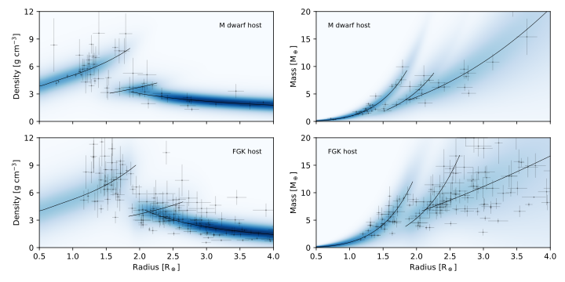

# Spright

Spright (/spraɪt/; [Parviainen, Luque, and Palle, 2023](https://doi.org/10.1093/mnras/stad3504)) is a fast Bayesian radius-density-mass relation for 
small planets.  The package allows one to predict planetary masses, densities, and RV semi-amplitudes given the 
planet's radius or planetary radii given the planet's mass.

The package offers an easy-to-use command line script for people not overly interested in coding and
a nearly-as-easy-to-use set of Python classes for those who prefer to code. The command line script can directly create 
publication-quality plots, and the classes offer a full access to the predicted numerical distributions.

The package contains two relations: one for small planets orbiting M dwarfs (inferred from a updated SPTM catalogue by
R. Luque) and another for planets orbiting FGK stars (inferred from a filtered TepCAT catalogue). 

## Installation

    pip install spright

## Usage

### From the command line

    spright --predict mass --radius 1.8 0.1 --plot-distribution

### Python code

    from spright import RMRelation 

    rmr = RMRelation()
    mds = rmr.predict_mass(radius=(1.8, 0.1))
    mds.plot()

### RV semi-amplitude prediction

The radial velocity semi-amplitude can be predicted given the planet's radius, orbital period, orbital eccentricity (optional),
and the host star mass.

    from spright import RMRelation 

    rmr = RMRelation()
    mds = rmr.predict_rv_semi_amplitude(radius=(1.8, 0.1), period=2.2, mstar=(0.5, 0.05), eccentricity=0.01)
    mds.plot()

Here the `RMRelation.predict_rv_semi_amplitude` method can also be given the planet's orbital eccentricity (`ecc`), 
and all the parameters (`radius`, `period`, `mstar`, and `eccentricity`) can either be floats, ufloats, or two-value tuples where the second value gives
the parameter uncertainty.

### Calculation of a new radius-density-mass relation

    from spright import RMEstimator
    
    rme = RMEstimator(names=names, radii=radii, masses=masses)
    rme.optimize()
    rme.sample()
    rme.compute_maps()
    rme.save('map_name.fits')

---
&copy; 2023 Hannu Parviainen
